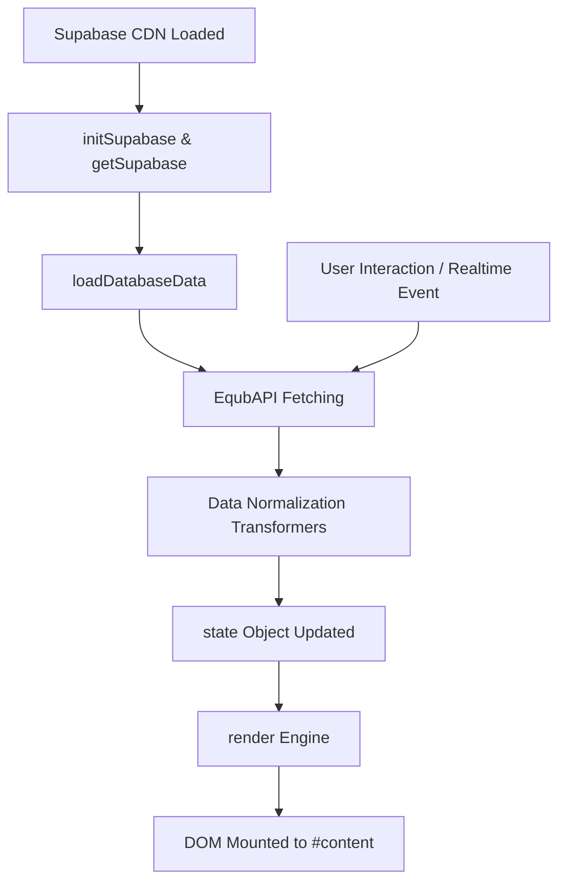
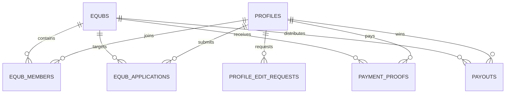

# Equb Admin — Technical Codebase Guide

> Direct, developer-focused technical guide to the codebase architecture, data flow, API methods, state management, and database schema.

---

## 1. Project Files

The repository uses a flat, zero-build structure that runs natively in any modern browser:

| File | Role & Contents |
| :--- | :--- |
| [`index.html`](index.html) | Semantic HTML shell containing sidebar navigation, top bar, dynamic content mount (`#content`), modal container (`#modalLayer`), and toast element (`#toast`). |
| [`app.js`](app.js) | Complete client-side application logic (~3,500 lines): Supabase SDK client, `EqubAPI` data layer, reactive state, SPA view renderers, and event listeners. |
| [`styles.css`](styles.css) | Vanilla CSS design system using CSS custom properties (`:root`), flex/grid layouts, high-contrast typography, and mobile bottom sheet styles. |
| [`database.sql`](database.sql) | PostgreSQL DDL script for Supabase: 9 tables, automated triggers, performance indexes, and Row Level Security (RLS) policies. |
| [`.env`](.env) | Supabase project URL and anon public key used for direct client-side database connections. |

---

## 2. Code Architecture & Execution Flow (`app.js`)

`app.js` is organized into 10 structured modules inside an Immediately Invoked Function Expression (IIFE):



### Module Breakdown

1. **Supabase Initialization (Lines 1–123)**:
   - Configures `supabaseClient` using `SUPABASE_URL` and `SUPABASE_ANON_KEY`.
   - `handleTableError()` logs actionable missing-table diagnostics without throwing unhandled exceptions.

2. **Data Access Layer (`EqubAPI`) (Lines 124–620)**:
   - Encapsulates all asynchronous Supabase PostgREST queries and Storage operations.
   - `getProfiles()`, `createProfile()`, `updateFullProfile()`, `updateAccountStatus()`
   - `getEqubs()`, `createEqub()`, `updateEqub()`, `deleteEqub()`
   - `getEqubMembers()`, `addMemberToEqub()`, `removeMemberFromEqub()`
   - `getEqubApplications()`, `approveApplication()`, `rejectApplication()`
   - `getPaymentProofs()`, `submitPaymentSlip()`, `verifyPaymentProof()`
   - `getAnnouncements()`, `createAnnouncement()`
   - `getPayouts()`, `recordPayout()`
   - `getProfileEditRequests()`, `approveProfileEditRequest()`, `rejectProfileEditRequest()`
   - `uploadProfilePhoto()` (Supabase Storage bucket upload)

3. **Application State (Lines 626–650)**:
   - Single central state object:
     ```javascript
     const state = {
       view: "overview",       // Active tab / page ID
       search: "",             // Active search query
       filter: "All",          // Active filter selection
       members: [],            // Transformed profiles array
       circles: [],            // Transformed equbs array
       signIns: [],            // Pending user registrations
       joins: [],              // Pending circle join applications
       payments: [],           // Submitted payment proofs
       profileEdits: [],       // Pending member profile updates
       announcements: [],      // Broadcast announcements
       activity: [],           // Merged activity event stream
       drawParticipants: [],   // Eligible lottery draw participants
       isLoading: true,
       lastSyncTime: "Just now"
     };
     ```

4. **Formatting Utilities (Lines 678–750)**:
   - `money(n)`: Formats numeric values to standard currency notation.
   - `initials(name)`: Extracts 2-letter uppercase initials for avatars.
   - `esc(str)`: Escapes HTML entities (`& < > " '`) to prevent XSS.
   - `formatDate(d)` & `formatTimeAgo(d)`: Timestamp parsers.
   - `pill(status)`: Generates color-coded semantic badge markup.

5. **Data Transformers (Lines 751–917)**:
   - Converts raw snake_case database records from PostgreSQL into clean, normalized JavaScript objects consumed by the renderers.
   - Cross-references relational IDs (e.g. mapping `user_id` and `equb_id` to member names and circle titles).
   - `buildActivityFeed()` merges and sorts recent actions across tables into a single chronological timeline.

6. **Data Sync & Realtime Engine (Lines 918–1030)**:
   - `loadDatabaseData()`: Executes parallel `Promise.all` queries across all 6 main tables, updates `state`, and calls `render()`.
   - `setupRealtime()`: Subscribes to Supabase Postgres CDC changes (`INSERT`, `UPDATE`, `DELETE`) on all tables to push live updates without polling.
   - Background polling fallback runs every 10 seconds if realtime drops.

7. **View Renderers (Lines 1031–2250)**:
   - Modular functions returning HTML string templates:
     - `dashboard()`: Metrics, liquidity summary, and activity timeline.
     - `reviewPage(type)`: Generic approval queue for registrations, join requests, payments, and profile edits.
     - `circlesPage()`: Equb pool management cards and circle rosters.
     - `membersPage()`: Searchable member directory with profile editing.
     - `lotteryPage()`: SVG Roulette Wheel animation and winner draw logic.
     - `announcementsPage()`, `databasePage()`, `settingsPage()`.

8. **Modals & Dialogs (Lines 2251–2800)**:
   - `openModal(type, id)` dynamically generates modal bodies (Create Equb, Member Details, Payment Slip Review, Add Member, etc.) and injects them into `#modalLayer`.

9. **Event Delegation & Actions (Lines 2801–3470)**:
   - Global event listeners (`click`, `submit`, `input`) delegate user actions using `data-action`, `data-view`, `data-modal`, and `data-id` attributes.
   - Form submission handlers parse `FormData` and call appropriate `EqubAPI` methods.

10. **Bootstrap (Lines 3480–3493)**:
    - Runs `render()`, `loadDatabaseData()`, and `setupRealtime()` on page load.

---

## 3. Database Schema & Automated Logic (`database.sql`)

### Tables & Relationships



| Table | Key Constraints & Types | Purpose |
| :--- | :--- | :--- |
| `profiles` | `id` UUID PK, `phone` UNIQUE, `account_status` CHECK | User profiles, phone authentication, role RBAC, and cached total savings. |
| `equbs` | `id` UUID PK, `total_pool` NUMERIC, `cycle_type` CHECK | Savings circles/pools, target amounts, round numbers, and schedule interval. |
| `equb_members` | `UNIQUE(equb_id, user_id)`, `UNIQUE(equb_id, position_number)` | Roster membership, rotation position (1..N), paid status, and payout flag. |
| `equb_applications` | `fin_number`, `fan_number`, `national_id_photo_url` | Join requests requiring admin KYC approval before circle enrollment. |
| `payment_proofs` | `transaction_id` UNIQUE, `amount` NUMERIC, `screenshot` TEXT | Bank transfer slips (CBE, Telebirr) submitted by users for round payments. |
| `payouts` | `winner_user_id` FK, `payout_amount` NUMERIC | Immutable records of lottery draw winners and disbursement references. |
| `announcements` | `equb_id` NULLABLE FK (NULL = global broadcast) | Admin broadcast messages and urgent notices. |
| `profile_edit_requests` | `user_id` FK, `status` CHECK | Queue for user-requested name/phone/ID modifications requiring admin review. |
| `system_audit_logs` | `actor_id` FK, `details` JSONB | Audit trail for security, actions, and compliance. |

### Database Triggers & Business Logic

1. **`on_payment_proof_approved` (`handle_payment_approval`)**:
   - Fires `AFTER UPDATE ON payment_proofs`.
   - When status becomes `APPROVED`, automatically updates `equb_members.total_contributions`, `equb_members.current_round_paid = TRUE`, and increments `profiles.total_savings` and `profiles.rounds_participated_count`.

2. **`on_application_approved` (`handle_application_approval`)**:
   - Fires `AFTER UPDATE ON equb_applications`.
   - When an application is approved, computes `MAX(position_number) + 1`, inserts a new row into `equb_members`, and increments `equbs.current_members`.

3. **`update_timestamp`**:
   - Automatically maintains `updated_at = NOW()` on `profiles` and `equbs`.

---

## 4. Local Development

1. **Run Database Migrations**:
   Copy the entire SQL script from [`database.sql`](database.sql) into the **SQL Editor** of your Supabase dashboard and click **Run**.

2. **Start Local Server**:
   ```bash
   # Option A: Python 3
   python -m http.server 8080

   # Option B: Node / npx
   npx serve .
   ```
   Open `http://localhost:8080` in your browser.
